# 🧠 Sentiment Analysis with Azure AI Language

This project was developed as part of a [DIO](https://www.dio.me/) challenge to explore the capabilities of **Azure Language Studio** by performing **Sentiment Analysis** using Microsoft's pre-trained models.

---

## 📁 Project Structure

```
📦 azure-sentiment-analysis
├── 📂 inputs
│   └── frases.txt              # Sentences used for analysis
├── 📂 prints
│   ├── CriacaoRecurso.jpg
│   ├── RecursoCarregado.jpg
│   ├── ClassifyText.jpg
│   ├── AnalyzeSentimentAndOpinions.jpg
│   ├── EnterTextToTryOut.jpg
│   ├── DocumentSentiment.jpg
│   ├── Sentence1.jpg → Sentence6.jpg
└── README.md
```

---

## 🚀 Steps Completed

### ✅ 1. Azure Resource Creation

Created a Language resource on Azure using the Free (F0) pricing tier.

📸 *Screenshot:*  
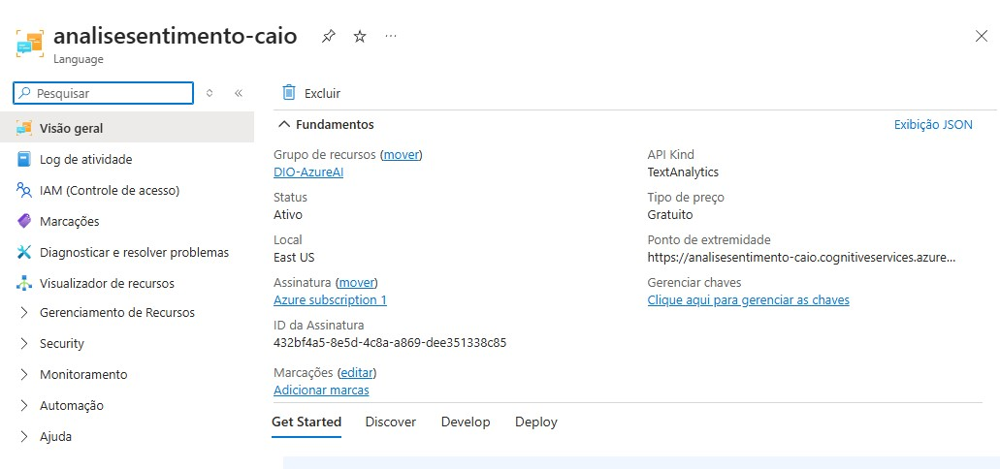

---

### ✅ 2. Linking Resource in Language Studio

The resource `analisesentimento-caio` was selected in [Language Studio](https://language.azure.com).

📸 *Screenshot:*  
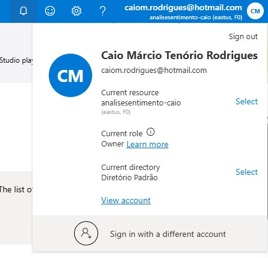

---

### ✅ 3. Opening Sentiment Analysis Tool

Navigated via **Classify text** → **Analyze sentiment and mine opinions**.

📸 *Screenshots:*  
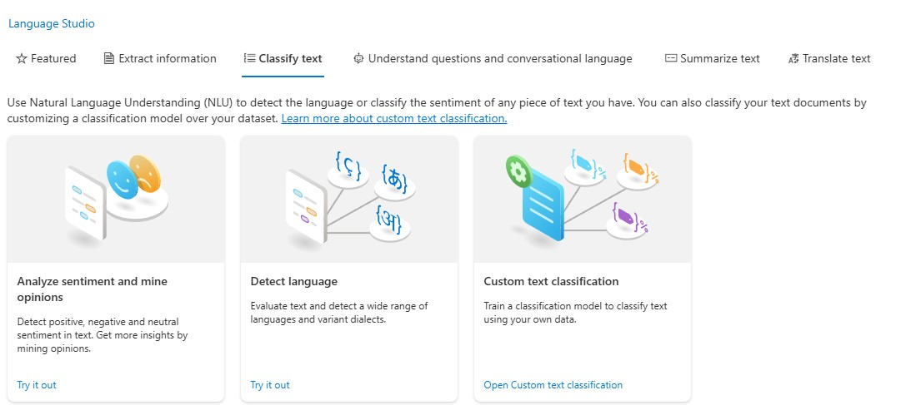  
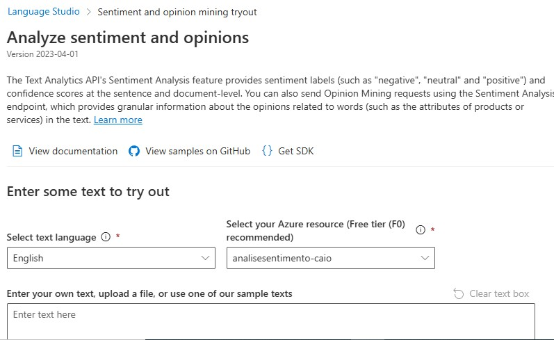

---

### ✅ 4. Inputting Sentences

The language was set to **Portuguese (Brazil)**. Input used:

```
Estou muito satisfeito com o atendimento.
A entrega atrasou e ninguém me avisou.
Achei o produto razoável, nada demais.
Excelente qualidade! Com certeza comprarei de novo.
Não recomendo, tive uma péssima experiência.
```

📸 *Screenshot:*  
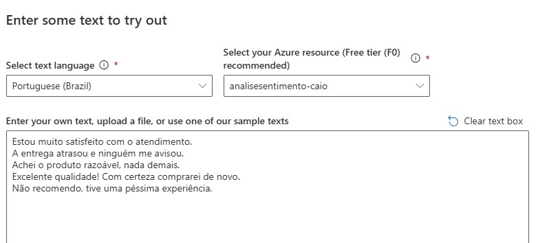

---

### ✅ 5. Overall Sentiment

Azure returned the **document-level sentiment** as *Mixed*, with the following confidence:

📸  
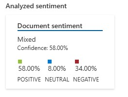

---

## 📊 Sentence-by-Sentence Analysis

### 🟩 **Sentence 1**
**Text:** “Estou muito satisfeito com o atendimento.”  
**Sentiment:** Positive – 98%  
📸  
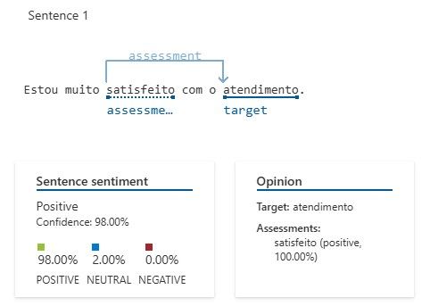

---

### 🟥 **Sentence 2**
**Text:** “A entrega atrasou e ninguém me avisou.”  
**Sentiment:** Negative – 99%  
📸  
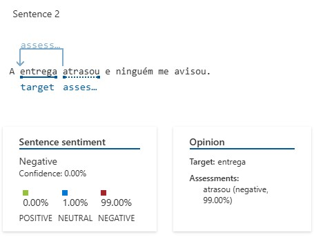

---

### 🟨 **Sentence 3**
**Text:** “Achei o produto razoável, nada demais.”  
**Sentiment:** Positive – 97%  
📸  


---

### 🟩 **Sentence 4**
**Text:** “Excelente qualidade!”  
**Sentiment:** Positive – 100%  
📸  
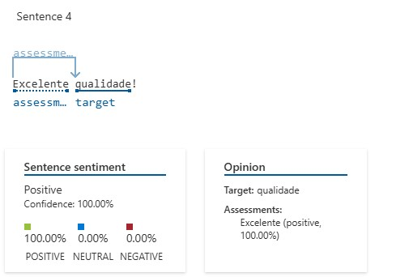

---

### 🟩 **Sentence 5**
**Text:** “Com certeza comprarei de novo.”  
**Sentiment:** Positive – *Low confidence* (52% positive / 48% neutral)  
📸  
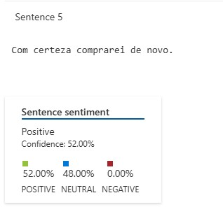

---

### 🟥 **Sentence 6**
**Text:** “Não recomendo, tive uma péssima experiência.”  
**Sentiment:** Negative – 100%  
📸  
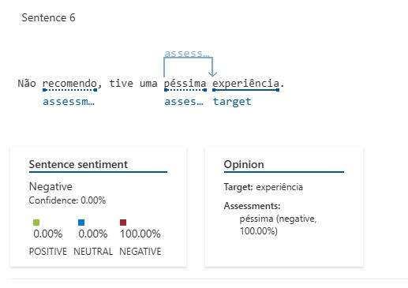

---

## 💡 Key Insights

- Azure AI performed well on clearly structured sentences.
- Mixed sentiment detection across multiple phrases worked as expected.
- Sentence 5 had **lower confidence**, indicating possible ambiguity.
- Opinion mining showed **target and assessment extraction** (e.g. produto → razoável).

---

## 🔮 Future Applications

- Customer review sentiment classification
- Integration into feedback collection tools
- Social media monitoring with real-time dashboards

---

## 📎 References

- [Microsoft Learn: Analyze Text with Azure AI Language](https://microsoftlearning.github.io/mslearn-ai-fundamentals/Instructions/Labs/06-text-analysis.html)
- [Azure Language Studio](https://language.azure.com)
---
